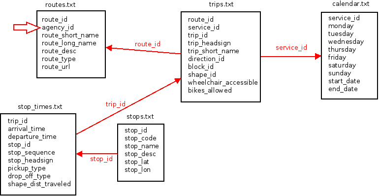

Introduction
============

[Où est mon bus ?](http://ouestmonbus.com) est une carte interactive en ligne basée sur OpenStreetMap et les données OpenData de Rennes Métropole.

L'application indique les arrêts de bus en temps réel.

En cliquant sur les arrêts de bus, les prochains passages des lignes sont affichés en direct en précisant un éventuel retard ou une avance.

La position des bus est indiquée sur la carte avec un rafraîchissement
automatique toutes les minutes et une animation donne une approximation
du déplacement des bus.

Caractéristiques principales :
------------------------------

* arrêts de bus affichés aux arrêts en temps réel, si un bus est prévu dans la journée.
* affichage des deux prochains passages de bus en temps réel sur les arrêts.
* affichage de la position des bus sur la carte.
* géolocalisation automatique ou avec saisie d'un lieu référencé sur OpenStreetMap (avec auto-complétion).
* informations traffic.
* informations @starbusmetro en temps réel.
* partage de liens avec localisation.
* consultation des fiches horaires officielles via les icônes des lignes.
* détails de la carte OpenStreetMap complets jusqu'au zoom maximum.

Ouestmonbus.com est une application simple et rapide pour ne plus rater son bus ! 

Elle peut être utilisée sans installation, simplement en se rendant sur le site [Où est mon bus ?](http://ouestmonbus.com) depuis un ordinateur, mobile ou tablette. 

Une version sur le store (Android dans un premier temps, est en cours de préparation).

Fonctionnalités détaillées:
===========================

* Les arrêts de bus sont affichés avec le symbole  si un bus est prévu avant la fin du la journée.
* Pour obtenir de meilleurs performances d'affichage et une meilleure visibilité, lorsque le zoom est inférieur à 16 sur la carte, les arrêts sont regroupés dans des bulles.
* Les horaires indiqués sont récupérés via les services du STAR et sont en temps réel.
* Les trajets des lignes de l'arrêt sont affichés sur la carte avec leurs couleurs.
* Les icônes de ligne de l'arrêt mettent en premier plan la ligne sur la carte.
* En cliquant sur le trajet sur la carte, le titre apparaît et un lien vers la fiche horaire est disponible.
* Les deux prochains passages dans l'heure sont indiqués.
* Le fond de carte provient d’OpenStreetMap et contient l'ensemble des données associées.
* L'avance ou le retard du bus est indiqué par rapport à l'horaire théorique de passage sur le prochain passage uniquement.
* L'URL (l'adresse) de la page contient les coordonnées, en partageant l'adresse complète vous partagez également la position de la carte:
  * par exemple http://ouestmonbus.com/#map=18/48.10874/-1.67512 partage la position du lycée Emile Zola.
* Le titre de l'arrêt de bus permet de centrer l'arrêt dans la carte.
* Lorsque le site est ouvert à l'emplacement d'un arrêt de bus, les informations de passage s’ouvrent automatiquement
  * par exemple http://ouestmonbus.com/#map=17/48.11274/-1.68021 affiche les passages à l'arrêt Champ Jacquet.
* La présence des arrêts sur la carte sont automatiquement rafraîchie toutes les 3 minutes sans actions utilisateurs.
* Les informations d'une station en cours d'affichage est rafraîchie toutes les minutes.
* Le titre de la page indique le lieu centré sur la carte.
* Intégration avec Twitter.
* Affichage des infos trafic via l'API star.
* Affichage les infos Twitter @starbusmetro.
* Saisie manuelle d'un lieu avec le clavier (service http://photon.komoot.de/)
* Sauvegarde des préférences (bulles d'aide déjà vus et dernière localisation)
* Affichage des bus lors du chargement de la station.
* Bouton zoom pour voir tous les bus en même temps avec la station interrogée.
* Rafraîchissement automatique de la position des bus (1 min) avec une barre de progression.
* Mise en cache des données dans le navigateur (pictogrammes et stations) quand c'est possible.

Fonctionnement technique et développement:
==========================================

Vous voulez modifier, copier, distribuer, [Où est mon bus ?](http://ouestmonbus.com) ?

Vous pouvez, en respectant la [licence GPL](http://www.gnu.org/licenses/gpl-3.0.fr.html) ! ([version complète licence](../COPYING))

Voici quelques explications sur le fonctionnement du logiciel.

Les données sont traitées en deux parties:
* la liste des stations générées avec le script generate.js (nodejs) chaque jour avec une tâche cron.
* les informations des passages (API explore en indiquant le numéro *idarret* / *stop_id* de la station)

La liste des stations est générée à partir des données [Données théoriques du réseau STAR](https://data.keolis-rennes.com/fr/les-donnees/donnees-telechargeables.html).
J'ai essayé de générer la liste des stations avec l'API explore, mais les performances sont moins bonnes, et la précision des informations (localisation de la station) moins juste.

Le format est le suivant:

    {
      "type": "Feature",
      "geometry": {
        "type": "Point",
        "coordinates": [
          "-1.6787340000",
          "48.1094050000"
        ]
      },
      "properties": {
        "id": "1167",
        "name": "République Pré Botté",
        "terminus": [
          "0053,1",
          "0064,0"
        ],
        "limits": [
          "06:25:00",
          "21:21:00"
        ],
        "lines": [
          "0053",
          "0064"
        ]
      }
    }

Pour m'aider au traitement des données j'ai réalisé un schéma au début de mon développement:

Un script télécharge automatiquement les derniers fichiers et génère les données suivantes:

- /data/ -> répertoire de données
- /data/downloads/ -> répertoire des zip téléchargés
- /data/GTFS/2015-08-13/ -> les données GTFS qui commence à partir du 2015-08-13	
- /data/today/ -> données statiques générés chaque jour par ouestmonbus.com
- /data/today/2015-07-19/ -> données statiques générés pour le 2015-07-19
- /data/today/2015-07-19/stations.geojson -> stations utilisés le 2015-07-19
- /data/today/2015-07-19/station_1035.json -> tous les passages prévus le 2015-07-19 à la station 1035 (pas encore implémenté, peut-être dans le futur)

Tuiles:
-------

Les tuiles proviennent d'une génération personnelle à partir des données de OpenStreetMap et Mapnik.
Elles sont hébergées sur le serveur de [Où est mon bus ?](http://ouestmonbus.com).

Tests:
------

La [page tests](/tests/) contient des tests unitaires réalisés avec [Jasmine](http://jasmine.github.io/).

Installer votre propre instance de ouestmonbus.com
==================================================

TODO

Reste à faire pour la version en cours:
=======================================

* notif de nouvelle version
* afficher une notif quand les données de la ligne ne sont pas dispo

Partiellement fait:
-------------------

Idées de développement pour une future version majeure:
=======================================================

* info trafic contextualisé en fonction des lignes sélectionnées [M]

  -> implémenter /api/records/1.0/search?dataset=tco-bus-topologie-lignes-td
  -> correspondance nom court - id
  -> filtrage

* fonction alerte de passage en html5 [XXL à découpé]

Optimisation possible:
----------------------

* utiliser momentjs fromnow pour l'affichage du temps restant

Bugs à corriger:
================

* mode paysage sur petite résolution

Non urgent:
-----------

* rendre robuste le générateur si téléchargement auto des zip (si zip incorrect)

Crédits:
========

© Copyright 2015-2016 - [Benoît Meunier](mailto:ouestmonbus@systemd.info) & Karin Cibard.

[Où est mon bus ?](http://ouestmonbus.com) est un logiciel libre sous [licence GPL](http://www.gnu.org/licenses/gpl-3.0.fr.html).

* Les données des horaires et les icônes du réseau STAR proviennent de https://data.keolis-rennes.com et https://data.explore.star.fr/explore/.
* Les tacets des lignes proviennent de http://www.data.rennes-metropole.fr/.
* Les icônes des bus sont réalisés par Freepik du site http://www.flaticon.com.
* Le reste du design provient de la librairie Metro UI CSS http://metroui.org.ua/ et Leaflet http://leafletjs.com/.

